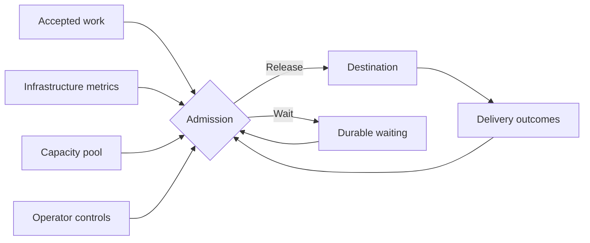

Admission control determines when an accepted action may leave Arklow. It evaluates the action's lane, the destination's recent behavior, and any shared capacity behind it.

 

## What does admission weigh?

| Input | What it describes |
|---|---|
| Waiting demand | How much work is ready, how long it has waited, and which work is already ahead in the lane |
| Destination behavior | Response time against its configured objective, acceptance, refusals, failures, and time to final settlement |
| Rate feedback | Explicit requests to slow down and any guidance about when to try again |
| [Infrastructure metrics](/resources/metrics/index) | Fresh measurements from the systems behind the destination |
| [Shared capacity](/resources/capacity-pools/index) | The pool's current budget and the lane's allocation within it |
| Operator controls | Temporary caps or a pause applied to the lane |

## Running and unsettled capacity

In addition, Admission takes great care to measure two important counters.

| Counter | What it includes
|---|---|
| Running | Delivery contact currently in progress |
| Unsettled | Running work and handed-off work awaiting a final outcome |

A destination that acknowledges work in its response may use running capacity only briefly. A destination that accepts work for later settlement continues to occupy unsettled capacity after the response. For example, an work given to one of your SDK listeners, will be counted as unsettled until the work is marked completed, either by you, or in the case of `Defer`, if you stop replying.

Both reservations apply. A destination may have room to begin another delivery while carrying too much unfinished work, or it may have unfinished-work room while its delivery contacts are already busy.

## Lanes

Lanes are described in detail [here](/resources/lanes/index).

## Waiting and recovery

An action awaiting admission enters `dispatch_wait` before any delivery attempt. Its action timeout continues to apply while it waits.

The action becomes eligible again as deliveries finish or settle, rate guidance clears, pool allocation changes, or a temporary control expires. Healthy outcomes and available capacity allow waiting work to resume. Admission remains active while a [scale target](/resources/scale-targets/index) adds capacity.

## Temporary caps and pauses

[Lane advice](/resources/lanes/index#limits-and-advice) can temporarily cap running or unsettled admission during an incident or maintenance window. A running cap of `0` pauses new admission. Advice can carry an expiry, after which the lane returns to its remaining controls.
