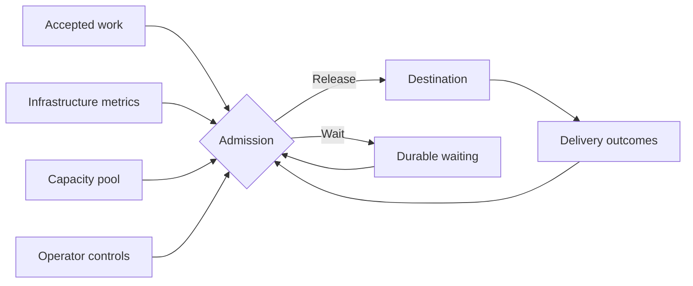

Admission control determines when an accepted action may leave Arklow. It evaluates the action's lane, the destination's recent behavior, and any shared capacity behind it. Until the current conditions permit release, the work remains durable and waits.

 

## What informs admission

| Input | What it describes |
|---|---|
| Waiting demand | How much work is ready, how long it has waited, and which work is already ahead in the lane |
| Destination behavior | Response time against its configured objective, acceptance, refusals, failures, and time to final settlement |
| Rate feedback | Explicit requests to slow down and any guidance about when to try again |
| [Infrastructure metrics](/resources/metrics/index) | Fresh measurements from the systems behind the destination |
| [Shared capacity](/resources/capacity-pools/index) | The pool's current budget and the lane's allocation within it |
| Operator controls | Temporary caps or a pause applied to the lane |

Delivery evidence is available from the first action. Linked metrics can widen that view when they are current and have a credible relationship with the work. Every active boundary must permit release.

## Running and unsettled capacity

Running and unsettled are two overlapping reservations for admitted work.

| Reservation | What it includes | What it protects |
|---|---|---|
| Running | Delivery contact currently in progress | The destination's ability to accept concurrent deliveries |
| Unsettled | Running work and handed-off work awaiting a final outcome | The total unfinished exposure carried by the destination |

A webhook that acknowledges work in its response may use running capacity only briefly. A webhook that accepts work for later settlement continues to occupy unsettled capacity after the response. An SDK listener occupies unsettled capacity while a claimed delivery remains open.

Both reservations apply. A destination may have room to begin another delivery while carrying too much unfinished work, or it may have unfinished-work room while its delivery contacts are already busy.

## Release pace

Where the destination supports pacing, admission also controls how quickly new delivery attempts begin. A destination can support several deliveries in progress while still needing new deliveries to begin farther apart.

For destination types that expose rate-limit responses or retry guidance, this can slow the release pace. Recent delivery behavior helps Arklow determine when that pace can increase again. An action can still wait for its release time when both reservations have room.

## Lane and pool boundaries

The [lane](/resources/lanes/index) keeps one customer, tenant, region, or workload scope separate at one destination. Its reservations, delivery history, pacing, and temporary controls remain local to that scope. Admission also respects eligible work already waiting in the lane.

A [capacity pool](/resources/capacity-pools/index) represents supply shared by one or more destinations. When the pool is constrained, its current allocation can narrow the amount of work a lane may release. The lane and pool boundaries both apply.

## Waiting and recovery

An action awaiting admission enters `dispatch_wait` before any delivery attempt. Its action timeout continues to apply while it waits.

The action becomes eligible again as deliveries finish or settle, rate guidance clears, pool allocation changes, or a temporary control expires. Healthy outcomes and available capacity allow waiting work to resume. Admission remains active while a [scale target](/resources/scale-targets/index) adds capacity.

## Temporary caps and pauses

[Lane advice](/resources/lanes/index#limits-and-advice) can temporarily cap running or unsettled admission during an incident or maintenance window. A running cap of `0` pauses new admission. Advice can carry an expiry, after which the lane returns to its remaining controls.
