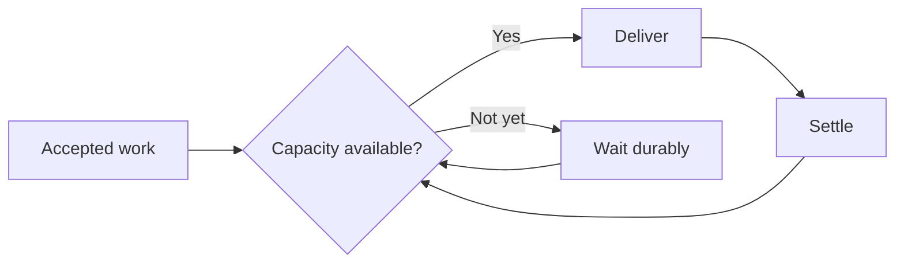

Admission control decides whether work should leave Arklow now or wait until a destination can safely accept it.

Arklow makes this decision for the action's [lane](/resources/lanes/index) and the destination's [capacity pool](/resources/capacity-pools/index). The tighter boundary controls delivery.

 

## Waiting for admission

An action awaiting admission enters `dispatch_wait` before any delivery attempt. The work remains in Arklow until capacity is expected to be available again or the action reaches its timeout.

This changes where overload appears. The destination sees less work at once, while Arklow carries the backlog where it can be released deliberately.

As admitted actions finish or settle, room opens and waiting work becomes eligible for delivery. Arklow can also pace releases when a destination asks callers to slow down.

## Running and unsettled capacity

A destination can finish accepting a delivery before the work itself is complete. Arklow therefore tracks two different kinds of pressure.

| Capacity | What it measures | What it protects |
|---|---|---|
| Running | Delivery contact currently in progress | The destination's ability to accept concurrent deliveries |
| Unsettled | Running work and handed-off work awaiting a final outcome | The total unfinished exposure the destination carries |

A webhook that acknowledges in its response may use running capacity only briefly. A webhook that accepts work and settles it later continues to use unsettled capacity after the response. An SDK listener also holds unsettled capacity while a claimed delivery remains open.

Admission uses the tighter limit. A destination may be ready to accept another request while still carrying too much unfinished work, or it may have settlement room while its request handlers are already busy.

## Operator caps

Lane advice can temporarily cap running or unsettled admission during an incident or maintenance window. The cap preserves waiting work and learned capacity. See [Limits and advice](/resources/lanes/index#limits-and-advice) for scope and expiry.

<Columns cols={2}>
  <Card
    title="Lanes"
    icon="road"
    href="/resources/lanes/index"
  >
    Identity, partition behavior, advice, and cardinality.
  </Card>
  <Card
    title="Capacity pools"
    icon="boxes-stacked"
    href="/resources/capacity-pools/index"
  >
    Shared supply, pool allocation, and budgets.
  </Card>
</Columns>
