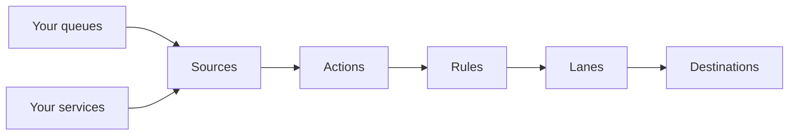

## Arrival

Somewhere in your infrastructure, work shows up. A customer places an order and a message lands on a queue. A [source](/resources/sources/index) is wherever that outstanding work sits. Today that includes SQS queues, Pub/Sub subscriptions, and [direct HTTP](/resources/sources/arklow/ingress) from your services.

The message comes in and becomes an action under one of your definitions. The definition names the kind of work, `orders.created` in this example, and can carry a schema its payloads must satisfy. The order itself is the payload, and its tags carry facts about it, like the region it came from. Arklow takes durable custody from here.

## Routing

Before the action moves, its definition's [rules](/resources/rules/index) run in priority order. These rules let you steer work by what it carries. Since our order came from the EU, a rule sends it to the destination serving that region. When no rule routes it, the action goes to the definition's default destination.

## Dispatch

The chosen destination and the action's tag values identify a [lane](/resources/lanes/index): the action's place in line. Our order, tagged `{"region": "eu"}`, waits behind other `eu` work and has nothing to do with the `us` lane beside it.

Each lane bounds how many deliveries are in flight, how much delivered work may sit unsettled, and how quickly new work goes out when the destination asks for pacing. The limits start conservative and adjust to what the destination shows it can handle. The `eu` lane has room, so the order dispatches and shows `running`. If it had to wait, it would hold here until capacity is expected to be available.

## Delivery

An attempt is one delivery of the action's payload to the [destination](/resources/destinations/index): wherever the work should land. For our order, that's your fulfilment service.

## Settlement

Delivered, the action waits in `ack_wait` while the destination works. Your fulfilment service processes the order and acks it, and the action ends in `succeeded`. A nack would send it back for another attempt, or end it in `failed` if permanent. A destination that needs more time can extend its deadline with a modack. A destination can settle immediately as part of taking the delivery, or later through the [settlement API](/resources/destinations/http/webhook).

An attempt left unsettled past its deadline is redelivered, so build your destination to expect the same unit of work more than once. An action that can't settle inside its timeout ends in `failed`.

## Pace

Throughout, the engine watches how each lane's deliveries go and keeps the lane's limits aligned with what the destination is handling. When a destination pushes back or slows down, Arklow eases off, and as capacity returns it speeds back up.

## Reference

<Columns cols={2}>
  <Card
    title="Quickstart"
    icon="rocket"
    href="/quickstart"
  >
  </Card>
</Columns>
