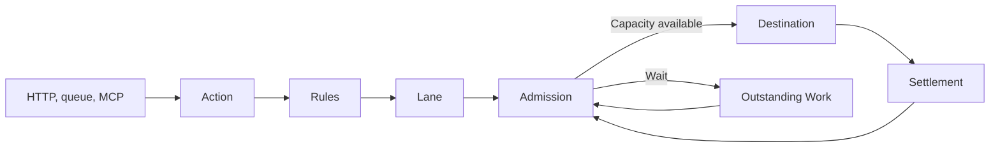

Arklow accepts work before it reaches the system that will perform it. Each accepted action has a durable record, so Arklow can route it, wait for capacity, deliver it, and account for its outcome.



<br />

<Note>
  When you send work through Arklow, it still runs on your own services and infrastructure.
</Note>

## What does Arklow help with?

Arklow helps manage these common infrastructure challenges:

- Product instability caused by constantly changing customer usage habits.
- Overprovisioning, or underprovisioning of infrastructure resources to meet these changing needs.
- Maximizing the useful capacity of your product's resources.

Here's the scenario: We're a platform that serves two customers, *Orange Labs* and *Kite AI*. As part of our product, we need to use and serve different types of Models, and different types of infrastructure components.

## First Steps

### Acceptance

We define `inference.requested` as an [action definition](/resources/actions/index). This allows Arklow to have a way to refer to this body of work, without needing to know exactly what's being done.

Work can be sent through over [API](/resources/sources/arklow/ingress) or taken from a connected [source](/resources/sources/index) (like a queue). Once we get confirmation from Arklow that it's been accepted, we can trust it will reach us as fast as we are capable of handling it.

### Routing

Our particular product might expose information like a `customer_id` in some format, whether as a tag, or as a field in the payload body.

[Rules](/resources/rules/index) inspect the action and select a [destination](/resources/destinations/index). They can also assign tags or change the destination before delivery, based upon some rules we can create.

For our platform, the final tags include:

```text
customer_id=orange_labs
model_id=translate-v2
region=us
```

Once decided, this unit of work becomes associated with an identity composed of these tags.

## Lanes

A [lane](/resources/lanes/index) is one entry point at one destination. Work resolved to the same lane shares occupancy, limits, pacing, and delivery history.

A good mental model for lanes is to consider them as per-customer, or per-actor.

### Partition tags

The inference destination uses `customer_id` as its partition tag. All Orange Labs actions sent to that destination share one lane, including actions with different models or regions. Kite AI actions use a separate lane.

```text
customer_id=orange_labs, model_id=translate-v2  → Orange Labs' lane
customer_id=orange_labs, model_id=summarize-v1 → Orange Labs' lane
customer_id=kite_ai, model_id=translate-v2 → Kite AI's lane
```

The partition tag carries your platform's existing customer, tenant, account, workspace, region, or workload identity into Arklow. Within that destination, the partition value determines which actions share a lane; the remaining tags stay available to rules and metrics.

### Destination scope

A lane belongs to one destination. Orange Labs work routed to a second destination uses a second Orange Labs lane. If both destinations ultimately use the same underlying infrastructure (like a GPU deployment, or a database), a capacity pool represents that shared supply.

| Question | Configuration | Example |
|---|---|---|
| Whose work shares admission limits? | Destination partition tag | `customer_id=orange_labs` |
| Which destinations draw from the same supply? | Capacity pool membership | `inference-us` |
| Which infrastructure changes size? | Scale target provider configuration | `translate-v2` deployment |
| Which measurements describe it? | Scale target metric binding | `model_id=translate-v2` |

## Admission

Admission evaluates the selected lane and the destination's [capacity pool](/resources/capacity-pools/index). An action moves to delivery only when both boundaries have room.

The decision to release work comprises multiple different inputs. [**Admission control**](/fundamentals/admission-control) explains how these inputs affect release.

### Waiting

When a decision to wait has been made, the action enters `dispatch_wait` before any delivery attempt begins. The record remains durable and is reconsidered as capacity becomes available. A full Orange Labs lane leaves Kite AI's lane allowance separate; their shared pool remains a second boundary.

## Delivery

### Settlement

The settlement boundary depends on the destination. For example, a webhook settles from its response or a later acknowledgement. An SDK listener claims work and settles it after processing. A publishing destination settles when its provider accepts the message.

Delivery is at least once. Destinations should use the action ID or a stable business identifier for idempotency. [Delivery guarantees](/fundamentals/delivery-guarantees) defines attempts, settlement, and redelivery.

## Shared infrastructure

### Infrastructure metrics

[Metric sources](/resources/metrics/index) add measurements from inside your infrastructure, model deployments, or provider(s). They can reveal shared pressure before things start to degrade and fail.

Metric identity stays separate from lane identity. In this example, `customer_id=orange_labs` selects the end-user lane while `model_id=translate-v2` identifies the deployment experiencing pressure.

### Capacity pools

The Orange Labs and Kite AI lanes both draw from the `inference-us` pool. A local lane limit controls one customer's work at one destination. The pool controls the aggregate supply used by every member lane and destination.

When that supply is constrained, admission can hold a busy contributor while preserving room for other active lanes. [Capacity pools](/resources/capacity-pools/index) define membership, allocation, and budgets.

### Scale targets

A [scale target](/resources/scale-targets/index) connects the pool to the `translate-v2` deployment. Sustained demand or matching infrastructure evidence can produce a bounded scale change for that resource.

Admission continues holding excess work while capacity provisions. As the destination reports healthier outcomes, lane limits reopen and the durable backlog drains.

<Columns cols={2}>
  <Card
    title="Admission control"
    icon="gauge"
    href="/fundamentals/admission-control"
  >
    Waiting, running and unsettled limits, pacing, and caps.
  </Card>
  <Card
    title="Lanes"
    icon="road"
    href="/resources/lanes/index"
  >
    Identity modes, partition behavior, advice, and cardinality.
  </Card>
  <Card
    title="Delivery guarantees"
    icon="shield"
    href="/fundamentals/delivery-guarantees"
  >
    Durable custody, attempts, settlement boundaries, and redelivery.
  </Card>
  <Card
    title="Capacity pools"
    icon="boxes-stacked"
    href="/resources/capacity-pools/index"
  >
    Shared supply, allocation, budgets, and attached scale targets.
  </Card>
</Columns>
