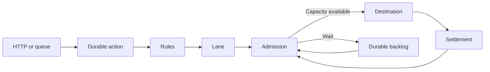

Arklow accepts work before it reaches the system that will perform it. Each accepted action has a durable record, so Arklow can route it, wait for capacity, deliver it, and account for its outcome after the caller disconnects.

Consider an inference platform that serves two customers, Acme and Initech. Both send work to a worker fleet through an Arklow destination. Each request carries the customer it belongs to and the model it needs.



<br />

<Note>
  When you send work through Arklow, it still runs on your own services and infrastructure. Arklow manages when work is released, how capacity is shared, and how scaling responds to demand.
</Note>

## Work enters Arklow

### Acceptance

The platform defines `inference.requested` as an [action](/resources/actions/index). The definition supplies the payload contract and flow used by every accepted request of that type.

Work can arrive through [HTTP ingress](/resources/sources/arklow/ingress) or a connected [queue source](/resources/sources/index). Acceptance creates one action record containing the payload, tags, state, and history. Completion happens later, independently of the connection used to submit it.

### Routing

[Rules](/resources/rules/index) inspect the action and select a [destination](/resources/destinations/index). They can also assign tags or change the outbound payload before delivery.

For this platform, the final tags include:

```text
customer_id=acme
model_id=translate-v2
region=us
```

The complete tag map remains attached to the action. Routing, metrics, and admission can use different parts of that context for different jobs.

## Lanes define who shares admission limits

A [lane](/resources/lanes/index) is one admission scope at one destination. Actions resolved to the same lane share occupancy, limits, pacing, and delivery history.

### Partition tags

The inference destination uses `customer_id` as its partition tag. All Acme actions sent to that destination share one lane, including actions with different models or regions. Initech actions use a separate lane.

```text
customer_id=acme, model_id=translate-v2  → Acme lane
customer_id=acme, model_id=summarize-v1 → Acme lane
customer_id=initech, model_id=translate-v2 → Initech lane
```

The partition tag carries your platform's existing customer, tenant, account, workspace, region, or workload identity into Arklow. Within that destination, the partition value determines which actions share a lane; the remaining tags stay available to rules and metrics.

### Destination scope

A lane belongs to one destination. Acme work routed to a second destination uses a second Acme lane. If both destinations consume the same worker fleet or provider quota, a capacity pool represents that shared supply.

| Question | Configuration | Example |
|---|---|---|
| Whose work shares admission limits? | Destination partition tag | `customer_id=acme` |
| Which destinations draw from the same supply? | Capacity pool membership | `inference-us` |
| Which infrastructure changes size? | Scale target provider configuration | `translate-v2` deployment |
| Which measurements describe it? | Scale target metric binding | `model_id=translate-v2` |

## Admission

Admission evaluates the selected lane and the destination's [capacity pool](/resources/capacity-pools/index). An action moves to delivery only when both boundaries have room.

Within a lane, admission checks work currently being delivered and work still awaiting final settlement. [Admission control](/fundamentals/admission-control#running-and-unsettled-capacity) defines both limits.

### Waiting

When a boundary is full, the action enters `dispatch_wait` before any delivery attempt begins. The record remains durable and is reconsidered as capacity becomes available. A full Acme lane leaves Initech's lane allowance separate; their shared pool remains a second boundary.

[Admission control](/fundamentals/admission-control) covers waiting, pacing, and operator caps in detail.

## Delivery and feedback

### Settlement

The settlement boundary depends on the destination. A webhook settles from its response or a later acknowledgement. An SDK listener claims work and settles it after processing. A publishing destination settles when its provider accepts the message.

Delivery is at least once. Destinations should use the action ID or a stable business identifier for idempotency. [Delivery guarantees](/fundamentals/delivery-guarantees) defines attempts, settlement, and redelivery.

### Delivery feedback

Arklow observes response time, refusals, failures, and the time work remains unsettled. Those outcomes change later admission decisions for the lane. A struggling destination receives less work; sustained healthy outcomes allow throughput to recover.

This feedback is available from the first delivery.

## Shared infrastructure

### Infrastructure metrics

[Metric sources](/resources/metrics/index) add measurements from inside the worker fleet, model deployment, or provider. They can reveal shared pressure before it appears as a delivery failure.

Metric identity stays separate from lane identity. In this example, `customer_id=acme` selects the end-user lane while `model_id=translate-v2` identifies the deployment experiencing pressure.

### Capacity pools

The Acme and Initech lanes both draw from the `inference-us` pool. A local lane limit controls one customer's work at one destination. The pool controls the aggregate supply used by every member lane and destination.

When that supply is constrained, admission can hold a busy contributor while preserving room for other active lanes. [Capacity pools](/resources/capacity-pools/index) define membership, allocation, and budgets.

### Scale targets

A [scale target](/resources/scale-targets/index) connects the pool to the `translate-v2` deployment. Sustained demand or matching infrastructure evidence can produce a bounded scale change for that resource.

Admission continues holding excess work while capacity provisions. As the destination reports healthier outcomes, lane limits reopen and the durable backlog drains.

<Columns cols={2}>
  <Card
    title="Admission control"
    icon="gauge"
    href="/fundamentals/admission-control"
  >
    Waiting, running and unsettled limits, pacing, and caps.
  </Card>
  <Card
    title="Lanes"
    icon="road"
    href="/resources/lanes/index"
  >
    Identity modes, partition behavior, advice, and cardinality.
  </Card>
  <Card
    title="Delivery guarantees"
    icon="shield"
    href="/fundamentals/delivery-guarantees"
  >
    Durable custody, attempts, settlement boundaries, and redelivery.
  </Card>
  <Card
    title="Capacity pools"
    icon="boxes-stacked"
    href="/resources/capacity-pools/index"
  >
    Shared supply, allocation, budgets, and attached scale targets.
  </Card>
</Columns>
