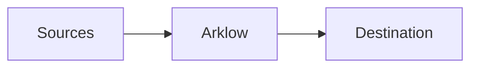

In this guide, we'll setup the minimum needed to get started with Arklow.



<Steps>
  <Step title="Create an Action">
    Actions define the work your platform does, bringing together everything. See the [Create Actions](https://app.arklow.io/dashboard/actions/new) page to create one.
  </Step>
  <Step title="Attach a Source">
    With your newly created Action. We need to give it a way to acquire new work. See below for supported `Sources` to attach to this action.

    <Tabs>
      <Tab title="Ingress">
        TODO
      </Tab>
      <Tab title="AWS SQS">
        Pull messages from an SQS Queue. See the [AWS SQS instructions page](/resources/destinations/aws/sqs).
      </Tab>
      <Tab title="Google Pub/Sub">
        Pull messages from a Pub/Sub Subscription. See the [Pub/Sub instructions page](/resources/destinations/gcp/pubsub).
      </Tab>
    </Tabs>
  </Step>
  <Step title="Pick the type">
    Set **Destination Type** to **Google Pub/Sub**.
  </Step>
  <Step title="Configure the topic">
    Enter the **Project ID** and **Topic ID**.
  </Step>
  <Step title="Select the credential">
    Under **Authentication**, select the GCP Service Account credential.
  </Step>
  <Step title="Save">
    Click **Create destination**.
  </Step>
</Steps>


## Authenticate

Create an API key under [**API Keys**](https://app.arklow.io/dashboard/settings?tab=keys). Send it as the `Authorization` header on every ingress call.

<Warning>Store the key somewhere safe.</Warning>

## Add a destination

A destination is where Arklow delivers processed work. Each type has its own settings.


## Define an action

An action defines work your platform does, named by a variant in dot notation like `text.generate`. Create one under [**Actions**](https://app.arklow.io/dashboard/actions), then link your destination to it on its **Flow** tab.

## Send work in

Work comes in through a source.

<Tabs>
  <Tab title="HTTP ingress">
    Post JSON to the ingress endpoint for your variant, with the key as the `Authorization` header.

    ```bash cURL
    curl -X POST https://ingress.arklow.io/v1/ingress/text.generate \
      -H "Authorization: YOUR_API_KEY" \
      -H "Content-Type: application/json" \
      -d '{"prompt":"write a haiku about estuaries"}'
    ```

    ```json Response
    {
      "data": {
        "a_id": "3625117063004160000",
        "a_def_id": "3625116817000000000",
        "queue_s": "queued",
        "a_va": "text.generate",
        "a_ve": "1"
      }
    }
    ```

    Find the record in [**Actions**](https://app.arklow.io/dashboard/actions) by its `a_id`.
  </Tab>
  <Tab title="AWS SQS">
    Connect an [SQS source](/resources/sources/aws/sqs) with a queue URL and region.
  </Tab>
  <Tab title="Google Pub/Sub">
    Connect a [Pub/Sub source](/resources/sources/gcp/pubsub) with a project and subscription.
  </Tab>
</Tabs>

## Next steps

<CardGroup cols={2}>
  <Card title="Sources" icon="arrow-down-to-line" href="/resources/sources/index">
    Bring work in from a source.
  </Card>
  <Card title="Destinations" icon="arrow-up-from-line" href="/resources/destinations/index">
    Deliver work to a destination.
  </Card>
  <Card title="Rules" icon="scale-balanced" href="/resources/rules/index">
    Rules evaluate before dispatch.
  </Card>
  <Card title="Credentials" icon="key" href="/resources/credentials/index">
    Credentials for your integrations.
  </Card>
</CardGroup>
