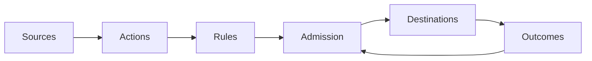

Arklow's goal is to find your infrastructure's ideal supply and demand curve.

Work arrives from your services and queues. Arklow accepts it durably, routes it, and holds excess demand until the destination can absorb it. During a downstream slowdown, excess work remains in Arklow and is released as capacity recovers.

 

<Note>
  Arklow can also track work that happens externally. Use the [SDK](/resources/destinations/sdk/index) when attaching existing pipelines to Arklow is impractical.
</Note>

<Columns cols={2}>
  <Card
    title="Quickstart"
    icon="rocket"
    href="/quickstart"
  >
    Send an action through Arklow and settle its first delivery.
  </Card>
  <Card
    title="How Arklow works"
    icon="puzzle-piece"
    href="/fundamentals/overview"
  >
    One action across lanes, admission, shared capacity, and settlement.
  </Card>
</Columns>

## Core resources

<Columns cols={2}>
  <Card
    title="Actions"
    icon="bolt"
    href="/resources/actions/index"
  >
    Define the work your platform performs.
  </Card>
  <Card
    title="Sources"
    icon="arrow-down-to-line"
    href="/resources/sources/index"
  >
    Bring work in over HTTP or from a queue you already run.
  </Card>
  <Card
    title="Destinations"
    icon="arrow-up-from-line"
    href="/resources/destinations/index"
  >
    Deliver work to webhooks, Pub/Sub, or SDK listeners.
  </Card>
  <Card
    title="Rules"
    icon="scale-balanced"
    href="/resources/rules/index"
  >
    Route, tag, transform, skip, or terminate work before dispatch.
  </Card>
</Columns>

## Capacity management

<Columns cols={2}>
  <Card
    title="Admission control"
    icon="gauge"
    href="/fundamentals/admission-control"
  >
    Waiting, running and unsettled limits, pacing, and caps.
  </Card>
  <Card
    title="Metrics"
    icon="chart-line"
    href="/resources/metrics/index"
  >
    Add the telemetry that already describes your systems.
  </Card>
  <Card
    title="Capacity pools"
    icon="boxes-stacked"
    href="/resources/capacity-pools/index"
  >
    Protect destinations that draw from the same underlying resource.
  </Card>
  <Card
    title="Scale targets"
    icon="arrow-up-right-dots"
    href="/resources/scale-targets/index"
  >
    Connect protected work to capacity Arklow can recommend or manage.
  </Card>
</Columns>

## API reference

<Card
  title="OpenAPI"
  icon="code"
  href="https://api.arklow.io/swagger/ui/json"
  horizontal
>
  Browse the complete HTTP API.
</Card>
