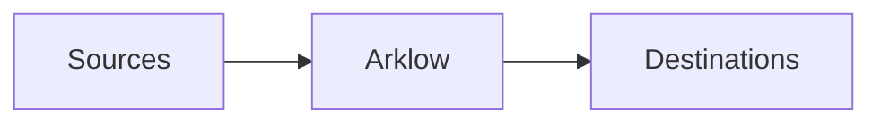

In this guide, we'll setup the minimum needed to get started with Arklow. You'll need an API key, found under [Settings](https://app.arklow.io/dashboard/settings).



<Steps>
  <Step title="Create an Action">
    Actions define the work your platform does, bringing together everything. Create one on the [Create Actions](https://app.arklow.io/dashboard/actions/new) page. The variant is the name work arrives under, `orders.created` for example.
  </Step>
  <Step title="Add a Destination">
    Create a [Webhook destination](/resources/destinations/http/webhook) pointed at an endpoint you run, and have that endpoint respond `200` with the header `x-arklow-signaling: ack`, which settles each delivery immediately. Other types of destinations we support are [here](/resources/destinations/index).
  </Step>
  <Step title="Link them">
    Open the action's **Flow** tab and use **Link destination** to attach yours.
  </Step>
  <Step title="Send work">
    Give the action work, straight over HTTP or from a queue you already run.

    <Tabs>
      <Tab title="HTTP">
        One POST to [ingress](/resources/sources/arklow/ingress) creates the action.

        ```bash
        curl -X POST https://ingress.arklow.io/v1/ingress/orders.created \
          -H "X-Arklow-Auth: $ARKLOW_API_KEY" \
          -H "Content-Type: application/json" \
          -d '{"order_id": "8471", "total": 129.50}'
        ```

        The response carries the action's id (`a_id`), already queued.
      </Tab>
      <Tab title="AWS SQS">
        Create an [SQS source](/resources/sources/aws/sqs) pointed at your queue, with its ingest set to your action. You'll need an [AWS credential](/resources/credentials/aws/access-keys). Arklow pulls each message and ingests it as one action, with the message body as the payload. Send a message to the queue to see it flow.
      </Tab>
      <Tab title="Google Pub/Sub">
        Create a [Pub/Sub source](/resources/sources/gcp/pubsub) pointed at your subscription, with its ingest set to your action. You'll need a [GCP Service Account credential](/resources/credentials/gcp/service-account). Arklow pulls each message and ingests it as one action, with the message data as the payload. Publish a message to see it flow.
      </Tab>
    </Tabs>
  </Step>
  <Step title="Watch it settle">
    Your endpoint receives one POST carrying the payload, and the ack settles it. The action moves from `queued` through `running` to `succeeded` on its page in the dashboard.
  </Step>
</Steps>

## Next steps

<CardGroup cols={2}>
  <Card title="How Arklow Works" icon="puzzle-piece" href="/fundamentals/overview">
    The path work takes from source to settlement.
  </Card>
  <Card title="Settling work" icon="server" href="/resources/destinations/http/webhook">
    The delivery contract, acks, nacks, and the settlement API.
  </Card>
  <Card title="Lanes" icon="road" href="/resources/lanes/index">
    Tag work by tenant or region. Each tag combination learns its own limits.
  </Card>
  <Card title="Rules" icon="scale-balanced" href="/resources/rules/index">
    Route, tag, skip, or terminate work before it dispatches.
  </Card>
</CardGroup>
